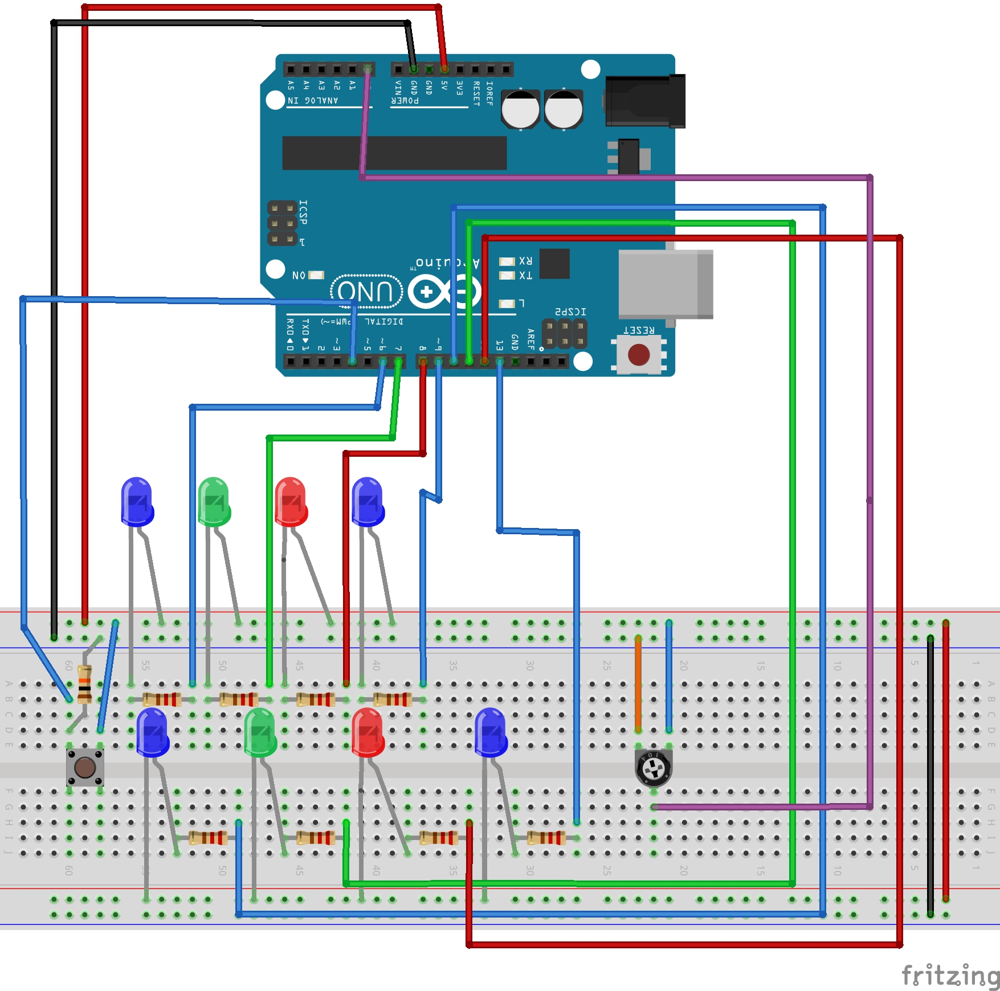
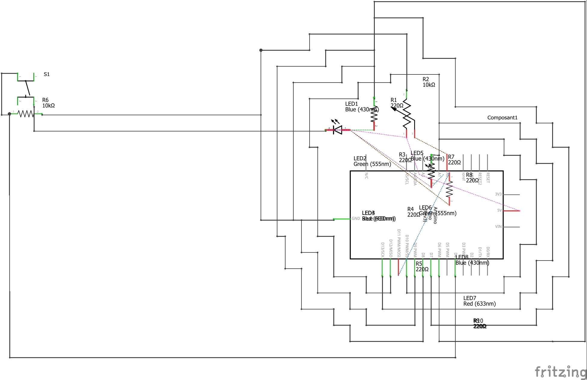

##  Material used :

* 8 LED
* 1 potentiometer
* 1 push button
* 8 resistors of 220 Ohm for the leds
* 1 resistor of 10 kOhm for the push button
* Arduino

-------------------------------------------------------------------------------------------------------

 reset and start by push button / PWM LED / PWM potentiometer

  the first and last LED remains at either `0` or `1`.

----------------------------------------------------------------------------------

 **Context :** When the button is pressed, the 8 LEDs light up one after the other with a `delay()` of 100 ms. If you press the button again, all the LEDs are reset, i.e. they go out one after the other.

 We have integrated a potentiometer that allows you to change the mode.  

 In our case there are two modes:

* Initial state, the LEDs light up one after the other.

* In the second state, the LEDs light up one after the other, but one with a shorter flicker and `delay()`.

 ### Input : 

* Push button, Potentiometer

### Output :

* LED

--------------------------------------------------

## Wiring diagram of the Christmas garland 	

